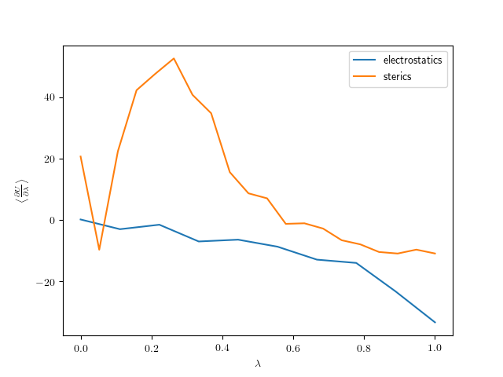

# Hydration Free Energy of Ethanol with OpenMM

This repository attempts to calculate the free energy of solvation of ethanol in water at standard temperature and pressure using openmm, openmmtools and openmmforcefields.

## Theory

The free energy of solvation can be obtained by integrating the work done along the path connecting the non-interacting state A and the fully interacting state B.


Here, v and w specify the solute and solvent indexes respectively. A hybrid Hamiltonian connecting these two states can be defined as follows,


where the free energy of solvation can be computed by discretizing the following integral,


Here, the energy components that connect the fully-interacting (\lambda = 1) and non-interacting (\lambda = 0) states are the nonbonded intermolecular interactions between solute and solvent. The other solute- and solvent-only interactions cancel/disappear upon taking the derivative of the hybrid hamiltonian.

In this project, the above integral was split into two steps:

1. Smoothly turn off the electrostatic contributions.
2. Smoothly turn off the lennard jones contributions.

for the electrostatic component, a grid of 10 lambda windows was used, while for the steric component 20 were used. All lambda windows were first equilibrated for 100ps in the NPT ensemble before averages of the hybrid-hamiltonian derivative were taken for 500ps.


## Use & Implementational Details

To use the code, simply type:

```python
python3 TI_ethanol_pme.py
```

Here's a brief summary of what the code does:

The solvated ethanol-water system is first prepared using SystemGenerator. A 12A TIP4PEW waterbox with nonbonded interactions cutoff set to 9A was created. Long range electrostatic interactions are evaluated with the PME method.

```python
ligand_mol = Molecule.from_file('ethanol.sdf', file_format='sdf')

forcefield_kwargs = {'constraints': app.HBonds, 'rigidWater': True, 'removeCMMotion': True, 'hydrogenMass': 4 * unit.amu }

system_generator = SystemGenerator(
    forcefields=["amber/ff14SB.xml", "amber/tip4pew_standard.xml"],
    small_molecule_forcefield="gaff-2.11",
    molecules=[ligand_mol],
    forcefield_kwargs=forcefield_kwargs)

ligand_pdb = PDBFile("ethanol.pdb")

modeller = Modeller(ligand_pdb.topology, ligand_pdb.positions)

modeller.addSolvent(system_generator.forcefield, model="tip4pew", padding=12.0 * unit.angstroms)

system = system_generator.forcefield.createSystem(modeller.topology, nonbondedMethod=PME,
        nonbondedCutoff=9.0 * unit.angstroms, constraints=HBonds)
```
The alchemical system is then prepared using openmmtools' alchemy.py code. All alchemical nonbonded forces (CustomNonbondedForce, CustomBondForce) are requested to have their energy derivative wrt. lambda computed (Note: why not included this in alchemy directly?). Annihilate sterics/electrostatics set to false as we only need to sterically+electrostatically decouple the solute from the solvent, not destroy the solute intramolecular interactions.

```python
solute_indexes = collect_solute_indexes(modeller.topology)

factory = alchemy.AbsoluteAlchemicalFactory(alchemical_pme_treatment='direct-space')

# Want to retain alchemical-alchemical nonbonded interactions as these are included in the decoupled endpoint solute + solvent system
alchemical_region = alchemy.AlchemicalRegion(alchemical_atoms=solute_indexes, annihilate_electrostatics=False, annihilate_sterics=False)
alchemical_system = factory.create_alchemical_system(system, alchemical_region)

# specify that we want to take energy derivatives on-the-fly with respect to both electrostatic and steric lambdas
for force in alchemical_system.getForces():
    if (force.__class__ == openmm.CustomNonbondedForce or force.__class__ == openmm.CustomBondForce):
        for i in range(0, force.getNumGlobalParameters()):
            if (force.getGlobalParameterName(i) == "lambda_electrostatics"):
                force.addEnergyParameterDerivative('lambda_electrostatics')
            elif (force.getGlobalParameterName(i) == "lambda_sterics"):
                force.addEnergyParameterDerivative('lambda_sterics')

alchemical_state = alchemy.AlchemicalState.from_system(alchemical_system)
```

The system is then minimized and undergoes 50ps of NPT equilibration using a Langevin thermostat /w a monte carlo barostat.

In the thermodynamic integration loop, the energy derivatives dU/dl are obtained with the following code:

```
state = context.getState(getEnergy=True, getParameterDerivatives=True)
energy = state.getPotentialEnergy()
energy_derivs = state.getEnergyParameterDerivatives()

energy_deriv = energy_derivs['lambda_electrostatics']
```

and finally the energy derivatives are integrated with a simple trapezium scheme.

## Issues

The free energy of solvation that this code produces are significantly different from literature. I'm using the work from Steinbrecher et. al. [here](https://onlinelibrary.wiley.com/doi/full/10.1002/jcc.21909) to compare against. In this work they use the GAFF forcefield and identical equilibration/production times as above, but they produce a solvation free energy of -4.3 kcal/mol (-18kJ/mol).  The code here produces 0.76 kJ/mol.

Additionally, the energy-derivative curves presented in the paper are significantly smoother for both electrostatic and vdW contributions to the free energy, both of which this code also produces very different results. The figure below shows an example profile.



A sample output is listed below:

```
ELECTROSTATICS
lambda <dV/dl>
 1.00 -33.54
 0.89 -23.45
 0.78 -14.14
 0.67 -13.07
 0.56 -8.83
 0.44 -6.55
 0.33 -7.14
 0.22 -1.66
 0.11 -3.13
 0.00  0.05
dG electrostatics, -10.523236740179035

STERICS
lambda <dV/dl>
 1.00 -11.06
 0.95 -9.80
 0.89 -11.08
 0.84 -10.57
 0.79 -8.09
 0.74 -6.74
 0.68 -2.92
 0.63 -1.20
 0.58 -1.38
 0.53  6.94
 0.47  8.58
 0.42 15.49
 0.37 34.72
 0.32 40.74
 0.26 52.62
 0.21 47.58
 0.16 42.25
 0.11 22.33
 0.05 -9.83
 0.00 20.60
dG sterics, 11.285538796216358

dG 0.7623020560373224
```