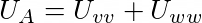
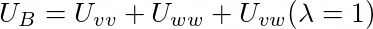
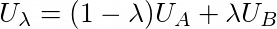
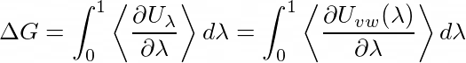

# FreeEnergyDerivatives


This repository provides OpenMM code to calculate the classical free energy of hydration of solutes using openmm and related packages. The code supports both standard and non-standard residues (using an AM1-BCC charge computation and the GAFF forcefield), as well as allowing the user to freeze the solute molecule if they're interested in coarse-grained integrals of the solvent-solute interaction.


## Requirements

openmm

openmmtools

openforcefield

openmmforcefields

## Installation ##

There should be no additional requirements for this package except for the above dependencies. Make sure your pythonpath is set to the following,

```
export PYTHONPATH=/path/to/FreeEnergyDerivatives:$PYTHONPATH
```

now you should be good to go!


## Theory

The free energy of solvation can be obtained by integrating the work done along the path connecting the non-interacting state A and the fully interacting state B.





Here, v and w specify the solute and solvent indexes respectively. A hybrid Hamiltonian connecting these two states can be defined as follows,



where the free energy of solvation can be computed by discretising the following integral,



Here, the energy components that connect the fully-interacting (\lambda = 1) and non-interacting (\lambda = 0) states are the nonbonded intermolecular interactions between solute and solvent. The other solute- and solvent-only interactions cancel/disappear upon taking the derivative of the hybrid hamiltonian.

In this project, the above integral was split into two steps:

1. Smoothly turn off the electrostatic contributions.
2. Smoothly turn off the lennard jones contributions.

for the electrostatic component, a default grid of 10 lambda windows is used, while for the steric component 20 were used. However these can be changed as per the users requirements. All lambda windows are first equilibrated for 100ps in the NPT ensemble before averages of the hybrid-hamiltonian derivative are taken for 500ps.


## Computing Hydration Energies

The script to compute the hydration free energy is located in federivatives/scripts/.

To use the code, simply type:

```python
python3 compute_solvation_energy.py -pdb ethanol.pdb -sdf ethanol.sdf -fit_forcefield 1
```
For non-standard "residues" such as ethanol, both a pdb and sdf file is required due to the dependence on openmmforcefields and openforcefield. Currently only water is supported as the solvent, however this is fairly easy to change. 

In this example using the script defaults, a solvated ethanol-water system is prepared using the SystemGenerator class. A 12A TIP3P waterbox with nonbonded interactions cutoff of 10.0A is used, where long range electrostatic interactions are evaluated with the Reaction Field method.


### Full Parameter List

the following arguments are supported by compute_solvation_energy.py:

```python
parser.add_argument('-sdf', type=str)
parser.add_argument('-pdb', type=str)
parser.add_argument('-freeze_atoms', type=int, default=0, choices=[0, 1])
parser.add_argument('-compute_forces', type=int, default=0, choices=[0, 1])
parser.add_argument('-fit_forcefield', type=int, default=0, help='True if non-standard residue simulated', choices=[0, 1])
parser.add_argument('-solute_indices', type=int, nargs='+', default=None)
parser.add_argument('-nelectrostatic_points', type=int, default=10)
parser.add_argument('-nsteric_points', type=int, default=20)
parser.add_argument('-nsamples', type=int, default=2500)  # 1ns 
parser.add_argument('-nsample_steps', type=int, default=200)  # 0.4ps using 2fs timestep
```

The arguments `nelectrostatic_points` and `nsteric_points` determine the number of windows along each path for each decoupling phase. For each window along a thermodynamic path, `nsamples` are taken where each is simulated for `0.4ps` after being equilibrated for `100ps` as detailed earlier. The solute indices can be specified with ```solute_indices``` (useful for self-hydration energies). 


## Notes ##

This package includes an explicit implementation of the lambda derivatives of the non-bonded interactions, as the energy derivatives provided by openmm (test in version 7.5),

```python
energy_derivs = state.getEnergyParameterDerivatives()
```

can incorrectly partition the electrostatic derivative into both the lambda_sterics and lambda_electrostatics. The explicit derivatives implemented here are not used during the dynamics of the individual windows along the TI path, and only act as observer functions to calculate the correct energy derivatives.

Note also that the code here defaults to simulations using CUDA. to force a CPU simulation, change the following lines,

```
platform = openmm.Platform.getPlatformByName('CUDA')
platform.setPropertyDefaultValue('Precision', 'mixed')
```

to,

```
platform = openmm.Platform.getPlatformByName('CPU')
```

